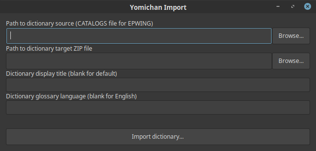

<!-- +++
Area = "projects"
GitHub = "yomichan-import"
Layout = "page"
Tags = ["epwing", "golang", "japanese", "mit license", "yomichan", "zero-epwing"]
Description = "External dictionary importer for the Yomichan browser extension."
Collection = "ProjectsActive"
+++ -->

# Yomichan Import

Yomichan Import allows users of the [Yomichan](https://foosoft.net/projects/yomichan) extension to import custom dictionary files. It currently
supports the following formats:

*   [JMdict](http://www.edrdg.org/jmdict/edict_doc.html)
*   [JMnedict](http://www.edrdg.org/enamdict/enamdict_doc.html)
*   [KANJIDIC2](http://www.edrdg.org/kanjidic/kanjd2index.html)
*   [Rikai](https://www.polarcloud.com/getrcx/)
*   [EPWING](https://ja.wikipedia.org/wiki/EPWING)
    *   [Daijirin](https://en.wikipedia.org/wiki/Daijirin) (三省堂　スーパー大辞林)
    *   [Daijisen](https://en.wikipedia.org/wiki/Daijisen) (大辞泉)
    *   [Kenkyusha](https://en.wikipedia.org/wiki/Kenky%C5%ABsha%27s_New_Japanese-English_Dictionary) (研究社　新和英大辞典　第５版)
    *   [Kotowaza](http://www.web-nihongo.com/wn/dictionary/dic_21/d-index.html) (故事ことわざの辞典)
    *   [Meikyou](https://ja.wikipedia.org/wiki/%E6%98%8E%E9%8F%A1%E5%9B%BD%E8%AA%9E%E8%BE%9E%E5%85%B8) (明鏡国語辞典)
    *   [Kojien](https://ja.wikipedia.org/wiki/%E5%BA%83%E8%BE%9E%E8%8B%91) (広辞苑第六版 &bull; 付属資料)
    *   [Gakken](https://ja.wikipedia.org/wiki/%E5%AD%A6%E7%A0%94%E3%83%9B%E3%83%BC%E3%83%AB%E3%83%87%E3%82%A3%E3%83%B3%E3%82%B0%E3%82%B9) (学研国語大辞典 &bull; 古語辞典 &bull; 故事ことわざ辞典 &bull; 学研漢和大字典)

Yomichan Import is being expanded to support other EPWING dictionaries based on user demand. This is a mostly
non-technical (although laborious) process that requires writing regular expressions and creating font tables; volunteer
contributions are welcome.

## Installation

Pre-built binaries are available for Linux, Mac OS X, and Windows on the [project
page](https://github.com/FooSoft/yomichan-import/releases).

## Basic Usage

Follow the steps outlined below to import your custom dictionary into Yomichan:

1.  Launch the `yomichan-gtk` executable after extracting the entire archive (or `yomichan` from the command line).
2.  Specify the source path of the dictionary you wish to convert.
3.  Specify the target path of the dictionary ZIP archive that you wish to create.
4.  Press the button labeled `Import dictionary...` and wait for processing to complete.
5.  On the Yomichan options page, browse to the dictionary ZIP archive file you created.
6.  Wait for the import progress to complete before closing the options page.

**Notice**: When converting EPWING dictionaries on Windows, it is important that the dictionary path you provide does
not contain non-ASCII characters (including Japanese characters). This problem is due to the fact that the EPWING
library used does not support such paths. Attempts to convert dictionaries stored in paths containing illegal characters
may cause the conversion process to fail.
